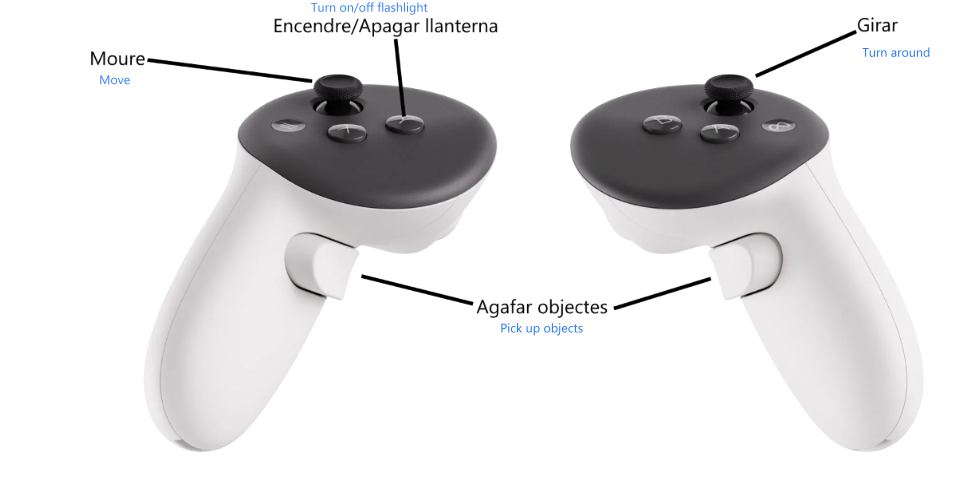

# VRProject
## 🇬🇧 English

### How to Play
Start the game: You start at the entrance of the dungeon with a lantern in your hand and a vending machine next to you.

Explore the dungeon: Move around the dungeon collecting valuable objects that you find on different altars. Remember that each object has a different weight and you may need both hands to carry it.

Avoid the enemy: There is an enemy who will try to finish you off, it will kill you instantly if it catches you. It pursues you at a distance and will only attack you when your lantern goes out.

Use the lantern: Your lantern is your only defense. You can dazzle enemies to give yourself time to escape. The lantern wears out over time, but you can recharge it by shaking your hand or selling objects.

Sell the objects: When you have objects, take them to the vending machine to get money and recharge the lantern battery. You will need a certain amount of money to be able to escape from the dungeon.

Escape from the dungeon: Once you have enough money, the door to escape from the dungeon will open automatically. Get to the door to move on to the next level.

### Controls
- Movement: Use the joystick to move. Teleport movement is not used.

- Grab objects: To grab objects, extend your hand towards the object and press the grab button. If you want to drop the object, simply release the button.

- Lantern: The lantern can be turned on and off with a button. To recharge the battery, shake your hand.

## Catalan

### Com Jugar

Inicia el joc: Comences a l'entrada de la dungeon amb una llanterna a la mà i una màquina de venda al teu costat.

Explora la dungeon: Mou-te per la dungeon recollint objectes valuosos que trobis en diferents altars. Recorda que cada objecte té un pes diferent i potser necessitaràs les dues mans per a portar-lo.

Evita l'enemic: Hi ha un enemic que intentarà acabar amb tu, et matarà instantàniament si arriba a atrapar-te. Et persegueix a distància i només t'atacarà quan la teva llanterna s'apagui.

Utilitza la llanterna: La teva llanterna és la teva única defensa. Pots enlluernar als enemics per donar-te temps per escapar. La llanterna es va gastant amb el temps, però pots recarregar-la sacsejant la mà o venent objectes.

Ven els objectes: Quan tinguis objectes, porta'ls a la màquina de venda per obtenir diners i recarregar la bateria de la llanterna. Necessitaràs una certa quantitat de diners per a poder escapar de la dungeon.

Escapa de la dungeon: Una vegada tinguis prou diners, la porta per escapar de la dungeon s'obrirà automàticament. Aconsegueix arribar a la porta per passar al següent nivell.
### Controls

- Moviment: Utilitza el joystick per moure't. No es fa servir moviment amb teleport.
- Agafar objectes: Per agafar objectes, allarga la mà cap a l'objecte i pressiona el botó de gravació. Si vols deixar l'objecte, simplement allibera el botó.
- Llanterna: La llanterna es pot encendre i apagar amb un botó. Per recarregar la bateria, sacseja la mà.

